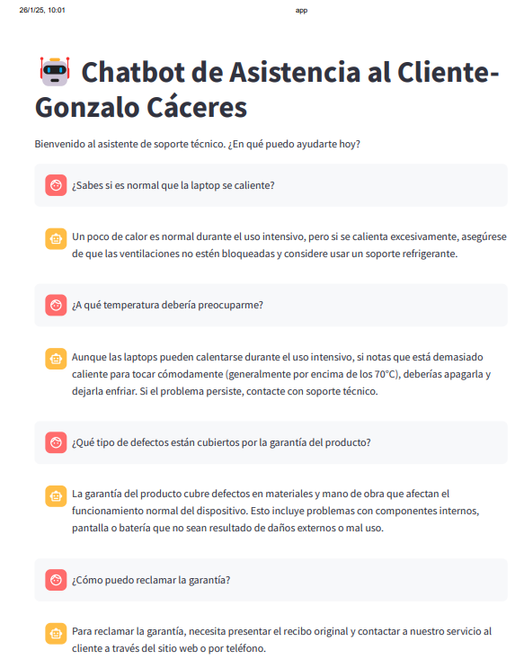
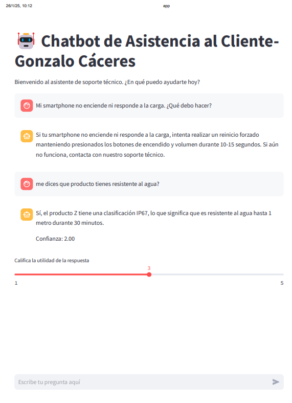
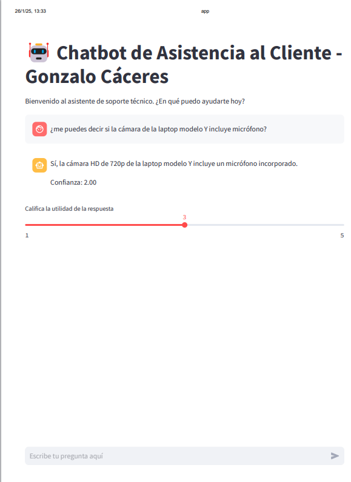

# Transformando el Soporte Técnico: Un Chatbot Inteligente para Asistencia Instantánea

## Introducción

El desarrollo de un chatbot de asistencia técnica para productos electrónicos es un proyecto ambicioso que busca resolver problemas comunes de los usuarios y proporcionar información útil de manera eficiente. Este documento detalla cómo se ha abordado el proyecto, desde la selección y preparación de datos hasta la implementación del modelo, considerando también el ciclo de vida del proyecto y su sostenibilidad a largo plazo.

Teniendo en cuenta los recursos (RAM 12,6 y uso de CPU) se utilizará el **Modelo BERT Multilingüe** (Permite manejar consultas en español y captura el significado contextual de las palabras), junto con la **Vectorización TF-IDF** (Computacionalmente menos intensivo que BERT, lo que ayuda a equilibrar el uso de recursos, permite una primera fase de filtrado eficiente y combina bien con BERT, ofreciendo tanto búsqueda por palabras clave como comprensión semántica).

Se presentan pruebas realizadas en consola, archivo `Bert-chat.ipynb`. Se realizan pruebas utilizando Streamlit para la interfaz interactiva, archivo `Bert_chat_streamlit.ipynb`.

## Definición del Problema

### Objetivo Específico:

Desarrollar un chatbot que:

- Responda consultas técnicas en español.
- Resuelva problemas comunes.
- Proporcione información sobre garantías.
- Funcione con alta precisión y naturalidad.

### Caracterización del Problema:

- **Dominio:** Soporte técnico de electrónica.
- **Idioma:** Español.
- **Tipo de Interacción:** Conversacional.
- **Complejidad:** Media-Alta.

## Selección y Preparación de Datos

1. **Definición del Conjunto Inicial de Datos:**
   - Se creó un conjunto inicial basado en ejemplos representativos de preguntas y respuestas comunes en el soporte técnico.

2. **Creación de un DataFrame:**
   - Los datos se organizaron en un DataFrame utilizando pandas, facilitando su manipulación.

3. **Generación de Variaciones de Preguntas:**
   - Se implementó una función que genera variaciones añadiendo prefijos y sufijos aleatorios, aumentando la robustez del modelo.

4. **Variaciones Adicionales:**
   - Por cada pregunta original, se generaron seis variaciones adicionales, diversificando el conjunto de datos.

5. **Mezcla Aleatoria de Filas:**
   - Las filas se mezclaron aleatoriamente para evitar sesgos en el entrenamiento.

6. **Guardado en un Archivo CSV:**
   - El conjunto preparado se guardó en un archivo CSV para facilitar su acceso futuro.

## Implementación del Modelo

Para resolver el problema definido, se ha elegido un enfoque que combina técnicas avanzadas de procesamiento del lenguaje natural (NLP):

- **Modelo BERT Multilingüe:**
  - Se utiliza BERT para obtener embeddings semánticos, lo que permite al chatbot comprender el contexto y significado detrás de las preguntas.

- **Vectorización TF-IDF:**
  - Se emplea TF-IDF para identificar coincidencias literales y mejorar la búsqueda inicial.

- **Búsqueda Semántica Híbrida:**
  - La combinación de similitud TF-IDF y embeddings BERT asegura que el chatbot no solo busque coincidencias literales, sino que también entienda el contexto.

## Adaptación

- Se implementaron técnicas de ingeniería de prompts.

## Evaluación

- El código incluye un sistema para que los usuarios califiquen la utilidad de las respuestas mediante un deslizador (st.slider), asignando una puntuación entre 1 y 5. Estas calificaciones se almacenan como parte de las interacciones en nuevas_interacciones, lo que permite medir la satisfacción del usuario y ajustar el modelo.
- Las pruebas en tiempo real permiten observar cómo el chatbot responde a consultas reales, lo que ayuda a identificar áreas de mejora, como preguntas mal interpretadas o respuestas incorrectas.

## MLOps

- La infraestructura se configuró en Google Colab, aprovechando sus recursos computacionales para el entrenamiento y ejecución del modelo.
- Se utiliza Streamlit para crear una interfaz interactiva, permitiendo a los usuarios interactuar fácilmente con el chatbot.
- El código incluye funciones para guardar y cargar el modelo, facilitando su mantenimiento y actualización.

## Integración

- Se planea desarrollar una API REST para facilitar la integración con otros sistemas.

La estimación de costos es baja debido al uso de Google Colab y modelos preentrenados, lo que permite una fácil escalabilidad a medida que se amplían las categorías de productos o se incorporan nuevos datos.

## Vida Útil del Modelo

La vida útil del modelo está sustentada por:

- **Aprendizaje Continuo:** A través del almacenamiento y análisis de interacciones con retroalimentación del usuario.
- **Actualizaciones Dinámicas:** El modelo se actualiza automáticamente al alcanzar un umbral específico de interacciones nuevas, asegurando que evolucione con las necesidades cambiantes de los usuarios.

## Conclusión

El enfoque sistemático adoptado para la selección y preparación de datos, junto con la implementación cuidadosa del modelo, asegura que el chatbot cumpla con los requerimientos técnicos establecidos. Al combinar calidad en la retroalimentación con un modelo robusto, se garantiza que el chatbot evolucione constantemente, mejorando su precisión y utilidad en el soporte técnico para productos electrónicos. Este proyecto no solo representa una solución innovadora sino también una herramienta valiosa para mejorar la experiencia del cliente en el ámbito tecnológico.

